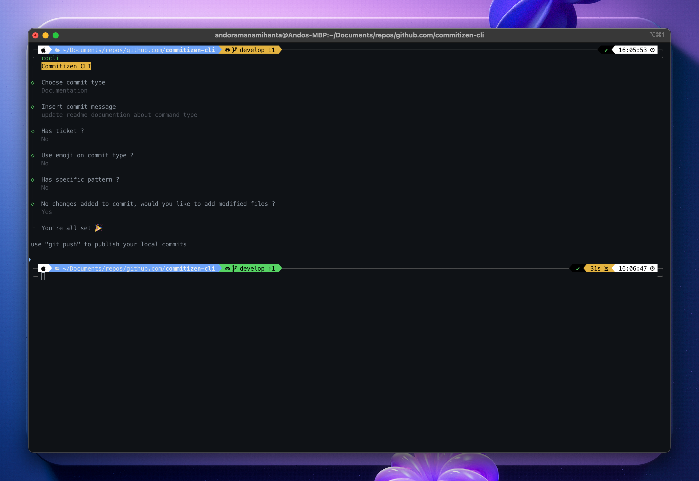

<p align="center">
  
</p>


Command-line interface tool that helps enforce standardized commit message formats in Git repositories.

<p align="center">
  
</p>

## Features

- **Standardized Commit Messages**: Enforce consistent commit message structure by guiding users through prompts and validating against specified formats.
- **Conventional Commit Support**: Easily generate commit messages following popular commit conventions like Conventional Commits.
- **User-Friendly Interface**: Interactive prompt-based interface for creating compliant commit messages without worrying about format details.
- **Integration with Git**: Seamlessly commit changes directly from the CLI, ensuring compliance with the chosen commit message convention.
- **Emoji Support**: Add emojis to your commit messages to express the nature of the changes or provide additional context.
- **Ticket Support**: Set ticket reference to your commit messages to link directly the changes with your task.
- **Specific Pattern**: Commit pattern is flexible and customisable to provide a better commit message convention.
- **Configuration Support**: Get or Set specific configuration like pattern config.

## Installation

To install commitizen-cli, use:

```shell
npm install -g commitizen-cli
```

or if you don't like to install it globaly, use:

```shell
npx commitizen-cli
```

## Usage

Navigate to your Git repository.

Run the following command:

```shell
commitizen-cli
```

or use the minified command:

```shell
cocli
```

## Updating from a Previous Version

If you have previously installed a version that is older than 3.0.0, it's important to follow these steps to ensure a smooth update process. The new version introduces significant changes that might conflict with remnants of the old installation.

It's recommended to use the clean command to remove any residual configurations that might still be present. Run the following command:

```shell
commitizen-cli clean
```

## Commands

### Update Command

The update command allows you to synchronize your local package with the latest changes from the package's repository. To update your package, run:

```shell
commitizen-cli update
```

This command will fetch the latest updates and apply them to your local package installation. Staying up to date ensures that you have access to new features, bug fixes, and enhancements provided by the package maintainers.

### Config Command

The config command is used to configure various settings for your package. It supports both get and set modes.

Get Mode

To retrieve configuration values, use the get mode:

```shell
commitizen-cli config get <key>
```

This command will display the current value associated with the specified configuration key.

Set Mode

To update configuration values, use the set mode:

```shell
commitizen-cli config set <key>=<value>
```

### Clean Command

The clean command allows you to reset the configuration settings. This command will clear all configurations inside the configuration file generated by the package. To reset the configuration, execute:

```shell
commitizen-cli clean
```

Please be cautious when using this command, as it will reset all configuration settings. This action is irreversible.

## Configuration

List of type available:

- feature ✨
- bugfix 🐛
- hotfix 🚑
- chore 🛠️
- epic 📌
- design 🎨
- experiment 🧪
- documentation 📝

Pattern is defined like this: `<type>`(`<ticket>`): `<commit>`

- `<type>`: Type of commit (feature, bugfix, documentation, ...)
- `<ticket>`: Reference of ticket (if ticket is defined)
- `<commit>`: Commit message

Example: design(XXX-000): implement responsive design

But `<ticket>` is an optional pattern, you can set it to false on prompt and the default pattern is like this: `<type>`: `<commit>`

Example: feature: implement new chat system on the frontend

And `<emoji>` is an optional pattern too, if you like to make your commit cool you can check the use emoji prompt and define custom pattern with `<emoji>`,
like this:

- if you have `<ticket>` reference: `<emoji>` `<type>`(`<ticket>`): `<commit>`: 📝 documention(XXX-000): creating new docs on the package
- or not: `<emoji>` `<type>`: `<commit>`: 📝 documention: creating new docs on the package

Get or Set configuration directly to save specific config, use:

```shell
commitizen-cli config get PATTERN
```

```shell
commitizen-cli config set PATTERN='specific pattern'
```

or using the minified command:

```shell
cocli config get PATTERN
```

```shell
cocli config set PATTERN='specific pattern'
```

### Update

To update to the latest version, use:

```shell
commitizen-cli update
```

or using the minified command:

```shell
cocli update
```

Follow the prompts to generate a standardized commit message.

The CLI will execute the Git command to commit your changes with the generated message.

## Support

Commitizen CLI is an MIT-licensed open source project. It can grow thanks to the sponsors and support.

## License

Commitizen CLI is [MIT licensed](LICENSE).
